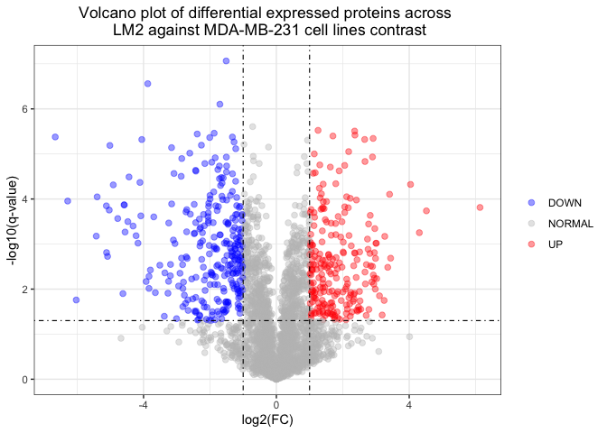
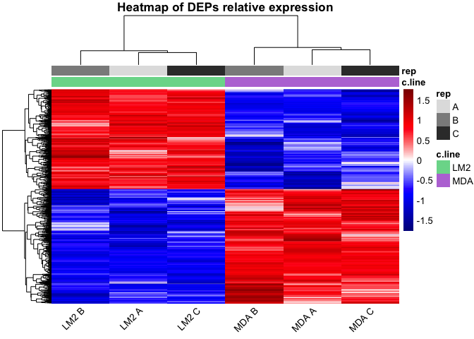

In this RMarkdown we are going to plot a DEPs analysis results. The DEPs were obtained by using **Perseus**: After the preprocessing steps, a T-test was performed, and the p-values were adjusted by FDR. The DEPs are the proteins that, in the contrast of LM2 against MDA-MB-231 have a **q-value<0.05 and a |log2(FC)|>1**.


# Libraries


```r
library(ggplot2)
library(pheatmap)
```

# Directories set-up


```r
path <- '/Volumes/TOSHIBA/4t/Proteòmica/Practiques/'
workingDir <- file.path(path, 'Data/')
resultsDir <- file.path(path, 'Results/')
setwd(workingDir)
```

# Perseus files


```r
path_v <- file.path(workingDir, 'volcano_plot_LM2-MDA.txt')
path_h <- file.path(workingDir, 'zscores_xheatmap_significants.txt')

volcano_data <- read.csv(path_v, sep = "\t")
heatmap_data <- read.csv(path_h, sep = "\t")
```

# Visualization

## Volcano plot


```r
volcano_data$DEPs <- "NORMAL"
volcano_data$DEPs[volcano_data$Difference > 1 & volcano_data$X.Log.P.value. > -log10(0.05)] <- "UP"
volcano_data$DEPs[volcano_data$Difference < -1 & volcano_data$X.Log.P.value. > -log10(0.05)] <- "DOWN"
head(volcano_data[,1:6])
```

```
##   Significant X.Log.P.value. Difference Majority.protein.IDs       Protein.IDs
## 1           +      1.3277500 -2.3400211               P0DPI2 P0DPI2;A0A0B4J2D5
## 2           +      3.9870450 -1.6142133               A0AV96            A0AV96
## 3                  0.5594367  0.3772532               A0AVT1            A0AVT1
## 4           +      1.7887254  0.8311399               A0FGR8            A0FGR8
## 5                  0.8433093 -1.5613340               A0MZ66            A0MZ66
## 6                  1.1579243 -0.2646643               A1L0T0            A1L0T0
##                                                                         Protein.names
## 1 Glutamine amidotransferase-like class 1 domain-containing protein 3A, mitochondrial
## 2                                                              RNA-binding protein 47
## 3                                         Ubiquitin-like modifier-activating enzyme 6
## 4                                                            Extended synaptotagmin-2
## 5                                                                           Shootin-1
## 6                                                  Acetolactate synthase-like protein
```


```r
ggplot(data = volcano_data, aes(x = Difference, y = X.Log.P.value., colour = DEPs)) +
    geom_point(alpha = 0.4, size = 2) +
    scale_color_manual(values = c("blue", "grey", "red")) +
    geom_vline(xintercept = c(-1, 1), lty = 4, col = "black", lwd = 0.4) +
    geom_hline(yintercept = -log10(0.05), lty = 4, col = "black", lwd = 0.4) +
    labs(x = "log2(FC)", y = "-log10(q-value)", 
         title = 'Volcano plot of differential expressed proteins across \n LM2 against MDA-MB-231 cell lines contrast') +
    theme_bw() +
    theme(plot.title = element_text(hjust = 0.5), 
          legend.position = "right", 
          legend.title = element_blank())
```

<!-- -->

## Heatmap


```r
h_matrix <- as.matrix(heatmap_data[,1:6])
h_matrix[, 1] <- gsub(",", ".", h_matrix[, 1])
h_matrix <- apply(h_matrix, 2, as.numeric)
colnames(h_matrix) <- c("LM2 A", "LM2 B", "LM2 C", "MDA A", "MDA B", "MDA C")
head(h_matrix)
```

```
##          LM2 A     LM2 B     LM2 C     MDA A     MDA B     MDA C
## [1,] -1.066820 -0.697664 -0.951397  0.963319  0.932270  0.820295
## [2,]  1.195100  0.238133  1.015020 -0.380236 -0.716336 -1.351680
## [3,] -1.000600 -1.136090 -0.533275  0.966152  0.991152  0.712660
## [4,]  0.945616  0.654602  1.021390 -0.640939 -1.352100 -0.628574
## [5,]  0.994802  0.205739  1.326890 -0.634524 -0.865088 -1.027820
## [6,]  0.869308  0.970437  0.827349 -0.780615 -0.604648 -1.281830
```

```r
annotation <- data.frame(c.line = factor(c(rep("LM2", 3), rep("MDA", 3))),
                         rep = factor(rep(c("A", "B", "C"), 2)))
rownames(annotation) <- colnames(h_matrix)
table(annotation)
```

```
##       rep
## c.line A B C
##    LM2 1 1 1
##    MDA 1 1 1
```

```r
annotation_colors <- list(
  c.line = c("LM2" = "#79D899", "MDA" = "#BA79D8"),
  rep = c("A" = "gray88", "B" = "gray55", "C" = "gray22"))
print(annotation_colors)
```

```
## $c.line
##       LM2       MDA 
## "#79D899" "#BA79D8" 
## 
## $rep
##        A        B        C 
## "gray88" "gray55" "gray22"
```


```r
pheatmap(
  h_matrix,
  annotation_col = annotation,  
  annotation_colors = annotation_colors,
  color = colorRampPalette(c("darkblue", "blue", "white", "red", "darkred"))(256),
  scale = "row",
  annotation_legend = TRUE, 
  angle_col = "45",
  main = "Heatmap of DEPs relative expression")
```

<!-- -->

# Save results


```r
up <- volcano_data[volcano_data[["DEPs"]] == "UP", ]
up <- up[order(up$Difference, decreasing = TRUE), ]
store = paste(resultsDir, 'up.tsv', sep='')
write.table(up, file=store, quote=FALSE, sep='\t', col.names=NA)

down <- volcano_data[volcano_data[["DEPs"]] == "DOWN", ]
down <- down[order(down$Difference, decreasing = FALSE), ]
store = paste(resultsDir, 'down.tsv', sep='')
write.table(down, file=store, quote=FALSE, sep='\t', col.names=NA)
```

# STRING analysis

This analysis has been done using the [STRING](https://string-db.org/) webpage. We have used the top 50 upregulated proteins and the top 50 downregulated proteins obtained in the analysis, ordered by its fold-change. 
**All parameters used on STRING are the default ones.**


---

